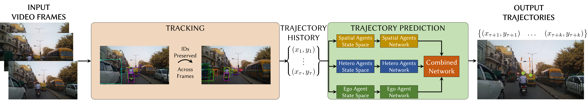

<div style="text-align: justify"> We present RobustTP, an end-to-end algorithm for predicting future trajectories of road-agents in dense traffic with noisy sensor input trajectories obtained from RGB cameras (either static or moving) through a tracking algorithm. In this case, we consider noise as the deviation from the ground truth trajectory. The amount of noise depends on the accuracy of the tracking algorithm. Our approach is designed for dense heterogeneous traffic, where the road agents corresponding to a mixture of buses, cars, scooters, bicycles, or pedestrians. RobustTP is an approach that first computes trajectories using a combination of a non-linear motion model and a deep learning-based instance segmentation algorithm. Next, these noisy trajectories are trained using an LSTM-CNN neural network architecture that models the interactions between road-agents in dense and heterogeneous traffic. Our trajectory prediction algorithm outperforms state-of-the-art methods for end-to-end trajectory prediction using sensor inputs. We achieve an improvement of upto 18% in average displacement error and an improvement ofup to 35.5% in final displacement error at the end of the prediction window (5 seconds) over the next best method. All experiments were set up on an Nvidia TiTan Xp GPU. Additionally, we release a software framework, TrackNPred. The framework consists of implementations of state-of-the-art tracking and trajectory prediction methods and tools to benchmark and evaluate them on real-world dense traffic datasets.</div>
<br>


|Paper|Software| Dataset|
|---|---|---|
|[**RobustTP**](http://rayguan97.github.io/files/tnp.pdf)| [**Code**](https://github.com/rohanchandra30/TrackNPred)|    [**TRAF**](https://drive.google.com/drive/folders/1zKaeboslkqoLdTJbRMyQ0Y9JL3007LRr?usp=sharing) |

<div style="text-align: justify"> <b>System Pipeline: </b></div>


<br>

Please cite our work if you found it useful,

```
@article{chandra2019robusttp,
  title={RobustTP: End-to-End Trajectory Prediction for Heterogeneous
Road-Agents in Dense Traffic with Noisy Sensor Inputs},
  author={Chandra, Rohan and Bhattacharya, Uttaran and Roncal, Christian and Bera, Aniket and Manocha, Dinesh},
  journal={arXiv preprint arXiv:1907.08752},
  year={2019}
}
```
