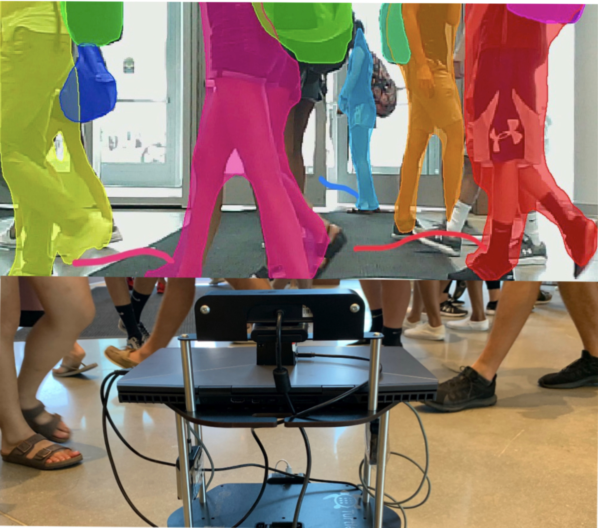

<p style="text-align:center;">

</p>

## Abstract

<div style="text-align: justify"> We present DenseCAvoid, a novel algorithm for navigating a robot through dense crowds and avoiding collisions by anticipating pedestrian behaviors. Our formulation uses visual sensors and a pedestrian trajectory prediction algorithm to track pedestrians in a set of input frames and compute bounding boxes that extrapolate to the pedestrian positions in a future time. Our hybrid approach combines this trajectory prediction with a Deep Reinforcement Learning-based collision avoidance method to train a policy to generate smoother, safer, and more robust trajectories during run-time. We train our policy in realistic 3-D simulations of static and dynamic scenarios with multiple pedestrians. In practice, our hybrid approach generalizes well to unseen, real-world scenarios and can navigate a robot through dense crowds (~1-2 humans per square meter) in indoor scenarios, including narrow corridors and lobbies. As compared to cases where prediction was not used, we observe that our method reduces the occurrence of the robot freezing in a crowd by up to 48%, and performs comparably with respect to trajectory lengths and mean arrival times to goal.</div>

<br>

## Video
<iframe width="720" height="405" src="https://www.youtube.com/embed/AsUbng-E8gg" frameborder="0" allow="accelerometer; autoplay; encrypted-media; gyroscope; picture-in-picture" allowfullscreen></iframe>

<br>

The paper is available [here](https://arxiv.org/abs/2002.03038). Please cite our work if you found it useful,

```
@INPROCEEDINGS{9197379,
  author={Sathyamoorthy, Adarsh Jagan and Liang, Jing and Patel, Utsav and Guan, Tianrui and Chandra, Rohan and Manocha, Dinesh},
  booktitle={2020 IEEE International Conference on Robotics and Automation (ICRA)}, 
  title={DenseCAvoid: Real-time Navigation in Dense Crowds using Anticipatory Behaviors}, 
  year={2020},
  volume={},
  number={},
  pages={11345-11352},
  doi={10.1109/ICRA40945.2020.9197379}
}
```
