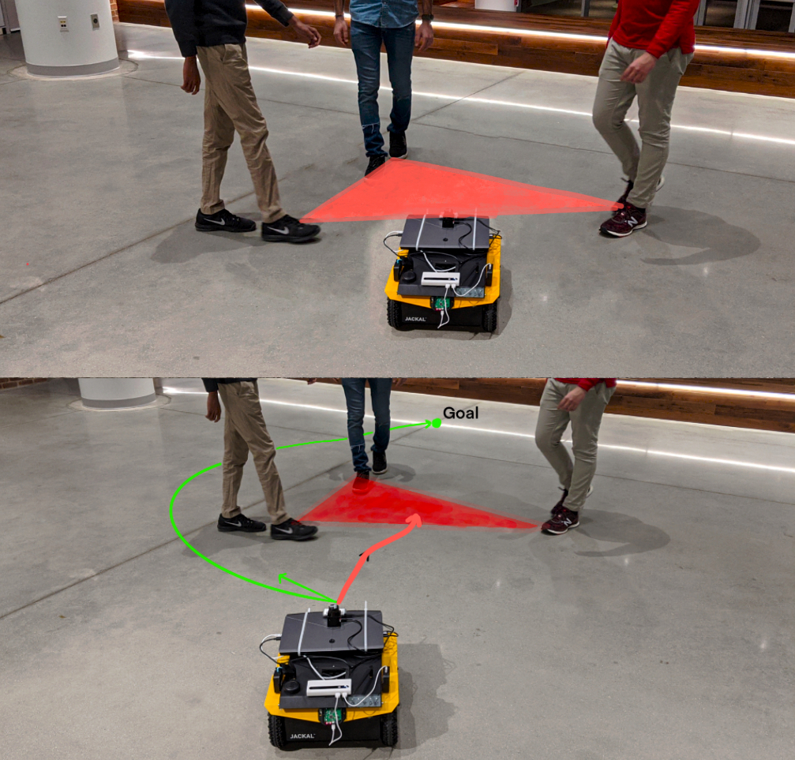

<p style="text-align:center;">

</p>

## Abstract

<div style="text-align: justify"> We present Frozone, a novel algorithm to deal with the Freezing Robot Problem (FRP) that arises when a robot navigates through dense scenarios and crowds. Our method senses and explicitly predicts the trajectories of pedestrians and constructs a Potential Freezing Zone (PFZ); a spatial zone where the robot could freeze or be obtrusive to humans. Our formulation computes a deviation velocity to avoid the PFZ, which also accounts for social constraints. Furthermore, Frozone is designed for robots equipped with sensors with a limited sensing range and field of view. We ensure that the robot's deviation is bounded, thus avoiding sudden angular motion which could lead to the loss of perception data of the surrounding obstacles. We have combined Frozone with a Deep Reinforcement Learning-based (DRL) collision avoidance method and use our hybrid approach to handle crowds of varying densities. Our overall approach results in smooth and collision-free navigation in dense environments. We have evaluated our method's performance in simulation and on real differential drive robots in challenging indoor scenarios. We highlight the benefits of our approach over prior methods in terms of success rates (upto 50% increase), pedestrian-friendliness (100% increase) and the rate of freezing (80% decrease) in challenging scenarios.</div>

<br>

## Video
<iframe width="720" height="405" src="https://www.youtube.com/embed/bejfMfpUyXA" frameborder="0" allow="accelerometer; autoplay; encrypted-media; gyroscope; picture-in-picture" allowfullscreen></iframe>

<br>

The paper is available [here](http://rayguan97.github.io/files/frozone.pdf). Please cite our work if you found it useful,

```
@ARTICLE{9099106,
  author={Sathyamoorthy, Adarsh Jagan and Patel, Utsav and Guan, Tianrui and Manocha, Dinesh},
  journal={IEEE Robotics and Automation Letters}, 
  title={Frozone: Freezing-Free, Pedestrian-Friendly Navigation in Human Crowds}, 
  year={2020},
  volume={5},
  number={3},
  pages={4352-4359},
  doi={10.1109/LRA.2020.2996593}
}
```
