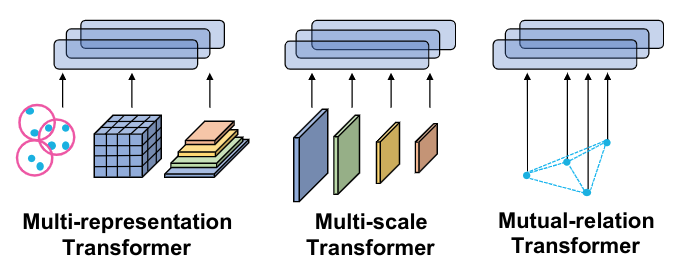

## Abstract
<div style="text-align: justify">We present a novel architecture for 3D object detection, M3DeTR, which combines different point cloud representations (raw, voxels, bird-eye view) with different feature scales based on multi-scale feature pyramids. M3DeTR is the first approach that unifies multiple point cloud representations, feature scales, as well as models mutual relationships between point clouds simultaneously using transformers. We perform extensive ablation experiments that highlight the benefits of fusing representation and scale, and modeling the relationships. Our method achieves state-of-the-art performance on the KITTI 3D object detection dataset and Waymo Open Dataset. Results show that M3DeTR improves the baseline significantly by 1.48% mAP for all classes on Waymo Open Dataset. In particular, our approach ranks 1st on the well-known KITTI 3D Detection Benchmark for both car and cyclist classes, and ranks 1st on Waymo Open Dataset with single frame point cloud input.</div>
<br>

|Paper|Code| Dataset| 
|---|---|---|----|
|[**M3DeTR**](http://rayguan97.github.io/files/m3detr.pdf)| [**To Be Released**](https://github.com/rayguan97/) |    [**KITTI**](http://www.cvlibs.net/datasets/kitti/eval_object.php?obj_benchmark=3d)/[**Waymo**](https://waymo.com/open/challenges/2021/real-time-3d-prediction/) |

<br>
Please cite our work if you found it useful,

```
@misc{guan2021m3detr,
      title={M3DeTR: Multi-representation, Multi-scale, Mutual-relation 3D Object Detection with Transformers}, 
      author={Tianrui Guan and Jun Wang and Shiyi Lan and Rohan Chandra and Zuxuan Wu and Larry Davis and Dinesh Manocha},
      year={2021},
      eprint={2104.11896},
      archivePrefix={arXiv},
      primaryClass={cs.CV}
}
```
