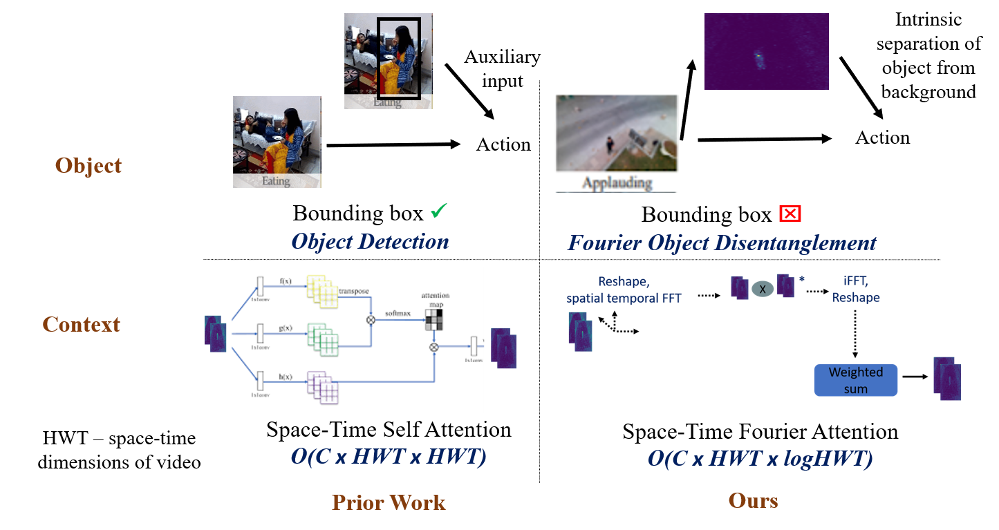

## Abstract

<div style="text-align: justify"> We present an algorithm, Fourier Activity Recognition (FAR), for UAV video activity recognition. Our formulation uses a novel Fourier object disentanglement method to innately separate out the human agent (which is typically small) from the background. Our disentanglement technique operates in the frequency domain to characterize the extent of temporal change of spatial pixels, and exploits convolution-multiplication properties of Fourier transform to map this representation to the corresponding object-background entangled features obtained from the network. To encapsulate contextual information and long-range space-time dependencies, we present a novel Fourier Attention algorithm, which emulates the benefits of self-attention by modeling the weighted outer product in the frequency domain. Our Fourier attention formulation uses much fewer computations than self-attention. We have evaluated our approach on multiple UAV datasets including UAV Human RGB, UAV Human Night, Drone Action, and NEC Drone. We demonstrate a relative improvement of 8.02% - 38.69% in top-1 accuracy and up to 3 times faster over prior works.</div>

<br>

<p style="text-align:center;">

</p>

<br>

The paper is available [here](https://arxiv.org/abs/2203.10694). Please cite our work if you found it useful,

```
@InProceedings{10.1007/978-3-031-19836-6_37,
author="Kothandaraman, Divya
and Guan, Tianrui
and Wang, Xijun
and Hu, Shuowen
and Lin, Ming
and Manocha, Dinesh",
editor="Avidan, Shai
and Brostow, Gabriel
and Ciss{\'e}, Moustapha
and Farinella, Giovanni Maria
and Hassner, Tal",
title="FAR: Fourier Aerial Video Recognition",
booktitle="Computer Vision -- ECCV 2022",
year="2022",
publisher="Springer Nature Switzerland",
address="Cham",
pages="657--676",
abstract="We present an algorithm, Fourier Activity Recognition (FAR), for UAV video activity recognition. Our formulation uses a novel Fourier object disentanglement method to innately separate out the human agent (which is typically small) from the background. Our disentanglement technique operates in the frequency domain to characterize the extent of temporal change of spatial pixels, and exploits convolution-multiplication properties of Fourier transform to map this representation to the corresponding object-background entangled features obtained from the network. To encapsulate contextual information and long-range space-time dependencies, we present a novel Fourier Attention algorithm, which emulates the benefits of self-attention by modeling the weighted outer product in the frequency domain. Our Fourier attention formulation uses much fewer computations than self-attention. We have evaluated our approach on multiple UAV datasets including UAV Human RGB, UAV Human Night, Drone Action, and NEC Drone. We demonstrate a relative improvement of 8.02{\%}--38.69{\%} in top-1 accuracy and up to 3 times faster over prior works.",
isbn="978-3-031-19836-6"
}
```
