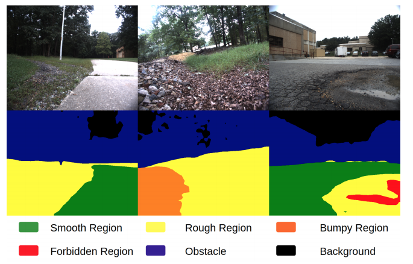

<!-- <p style="text-align:center;">

</p> -->

## Abstract
<div style="text-align: justify">We present a terrain traversability mapping and navigation system (TNS) for autonomous excavator applications in an unstructured environment. We use an efficient approach to extract terrain features from RGB images and 3D point clouds and incorporate them into a global map for planning and navigation. Our system can adapt to changing environments and update the terrain information in real-time. Moreover, we present a novel dataset, the Complex Worksite Terrain (CWT) dataset, which consists of RGB images from construction sites with seven categories based on navigability. Our novel algorithms improve the mapping accuracy over previous SOTA methods by 4.17-30.48% and reduce MSE on the traversability map by 13.8-71.4%. We have combined our mapping approach with planning and control modules in an autonomous excavator navigation system and observe 49.3% improvement in the overall success rate. Based on TNS, we demonstrate the first autonomous excavator that can navigate through unstructured environments consisting of deep pits, steep hills, rock piles, and other complex terrain features. Dataset, videos, and a full technical report are available at https://gamma.umd.edu/tns/.</div>
<br>

|Paper| Dataset|
|---|---|---|----|
|[**TNS**](https://arxiv.org/abs/2109.06250)|  [**CWT**](https://forms.gle/zeAcgptpideCrFbw8)|

<br>

## Video
<iframe width="720" height="405" src="https://www.youtube.com/embed/Fo-QhEP9ufI" frameborder="0" allow="accelerometer; autoplay; encrypted-media; gyroscope; picture-in-picture" allowfullscreen></iframe>

<br>
Please cite our work if you found it useful,

```
@misc{guan2021tns,
      title={TNS: Terrain Traversability Mapping and Navigation System for Autonomous Excavators}, 
      author={Tianrui Guan and Zhenpeng He and Ruitao Song and Dinesh Manocha and Liangjun Zhang},
      year={2021},
      eprint={2109.06250},
      archivePrefix={arXiv},
      primaryClass={cs.RO}
}
```

