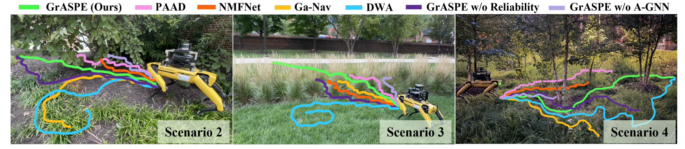
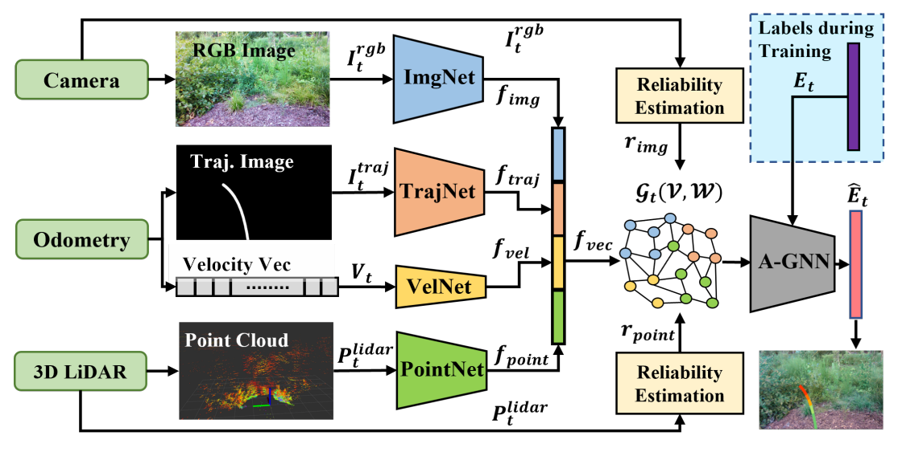

<p style="text-align:center;">

</p>

## Abstract

<div style="text-align: justify"> We present a novel trajectory traversability estimation and planning algorithm for robot navigation in complex outdoor environments. We incorporate multimodal sensory inputs from an RGB camera, 3D LiDAR, and the robot's odometry sensor to train a prediction model to estimate candidate trajectories' success probabilities based on partially reliable multi-modal sensor observations. We encode high-dimensional multi-modal sensory inputs to low-dimensional feature vectors using encoder networks and represent them as a connected graph. The graph is then used to train an attention-based Graph Neural Network (GNN) to predict trajectory success probabilities. We further analyze the number of features in the image (corners) and point cloud data (edges and planes) separately to quantify their reliability to augment the weights of the feature graph representation used in our GNN. During runtime, our model utilizes multi-sensor inputs to predict the success probabilities of the trajectories generated by a local planner to avoid potential collisions and failures. Our algorithm demonstrates robust predictions when one or more sensor modalities are unreliable or unavailable in complex outdoor environments. We evaluate our algorithm's navigation performance using a Spot robot in real-world outdoor environments. We observe an increase of 10-30% in terms of navigation success rate and a 13-15% decrease in false positive estimations compared to the state-of-the-art navigation methods.
</div>

<br>

<p style="text-align:center;">

</p>

## Video
<iframe width="720" height="405" src="https://www.youtube.com/embed/35hT8gokWhc" frameborder="0" allow="accelerometer; autoplay; encrypted-media; gyroscope; picture-in-picture" allowfullscreen></iframe>

<br>
The paper is available [here](https://arxiv.org/abs/2209.05722). Please cite our work if you found it useful,

```
@ARTICLE{weerakoon2022graspe,
      title={GrASPE: Graph based Multimodal Fusion for Robot Navigation in Unstructured Outdoor Environments}, 
      author={Kasun Weerakoon and Adarsh Jagan Sathyamoorthy and Jing Liang and Tianrui Guan and Utsav Patel and Dinesh Manocha},
      year={2023},
      journal={IEEE Robotics and Automation Letters}, 
}
```
