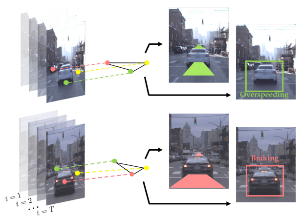

<p style="text-align:center;">

</p>

## Abstract
<div style="text-align: justify"> We present a novel approach for traffic forecasting
in urban traffic scenarios using a combination of spectral
graph analysis and deep learning. We predict both the lowlevel information (future trajectories) as well as the high-level
information (road-agent behavior) from the extracted trajectory
of each road-agent. Our formulation represents the proximity
between the road agents using a weighted dynamic geometric
graph (DGG). We use a two-stream graph-LSTM network to
perform traffic forecasting using these weighted DGGs. The first
stream predicts the spatial coordinates of road-agents, while
the second stream predicts whether a road-agent is going to
exhibit overspeeding, underspeeding, or neutral behavior by
modeling spatial interactions between road-agents. Additionally,
we propose a new regularization algorithm based on spectral
clustering to reduce the error margin in long-term prediction
(3-5 seconds) and improve the accuracy of the predicted
trajectories. Moreover, we prove a theoretical upper bound
on the regularized prediction error. We evaluate our approach
on the Argoverse, Lyft, Apolloscape, and NGSIM datasets and
highlight the benefits over prior trajectory prediction methods.
In practice, our approach reduces the average prediction error
by more than 75% over prior algorithms and achieves a
weighted average accuracy of 91.2% for behavior prediction.
Additionally, our spectral regularization improves long-term
prediction by up to 70%. </div>
<br>


|Paper|Code| Dataset  | Supplementary Material |
|:---|---|---|---|
|[**SC-GLSTM**](https://arxiv.org/abs/1912.01118) | [**GitHub Code**](https://github.com/rohanchandra30/Spectral-Trajectory-Prediction)| [**Lyft**](https://level5.lyft.com/dataset/) / [**Apolloscape**](http://apolloscape.auto/trajectory.html) / [**Argoverse**](https://www.argoverse.org/data.html)    | [**Supplementary Material**](http://rayguan97.github.io/files/sc-glstm_sup.pdf)|

<br>


<div style="text-align: justify"> <b>Network Architecture: </b> We show the trajectory and behavior prediction for the i-th road-agent (red circle in the traffic-graphs). The input consists of the spatial coordinates over the past T seconds as well as the eigenvectors (green rectangles, each shade of green represents the index of the eigenvectors) of the traffic-graphs corresponding to the first T traffic-graphs. We perform spectral clustering on the predicted eigenvectors from the second stream (orange block) to regularize the original loss function and perform backpropagation on the new loss function to improve long-term prediction. </div>

<br>


<p align="center"><iframe width="805" height="442" src="https://obj.umiacs.umd.edu/gamma-umd-website-imgs/researchdirections/autonomousdriving/results.gif" allowfullscreen></iframe></p>


Please cite our work if you found it useful,

```
@ARTICLE{9126166,
  author={Chandra, Rohan and Guan, Tianrui and Panuganti, Srujan and Mittal, Trisha and Bhattacharya, Uttaran and Bera, Aniket and Manocha, Dinesh},
  journal={IEEE Robotics and Automation Letters}, 
  title={Forecasting Trajectory and Behavior of Road-Agents Using Spectral Clustering in Graph-LSTMs}, 
  year={2020},
  volume={5},
  number={3},
  pages={4882-4890},
  doi={10.1109/LRA.2020.3004794}
}
```
