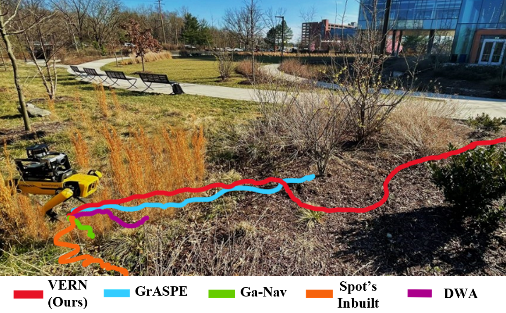

<p style="text-align:center;">

</p>

## Abstract
<div style="text-align: justify">We propose a novel method for autonomous legged robot navigation in densely vegetated environments with a variety of pliable/traversable and non-pliable/untraversable vegetation. We present a novel few-shot learning classifier that can be trained on a few hundred RGB images to differentiate flora that can be navigated through, from the ones that must be circumvented. Using the vegetation classification and 2D lidar scans, our method constructs a vegetation-aware traversability cost map that accurately represents the pliable and non-pliable obstacles with lower, and higher traversability costs, respectively. Our cost map construction accounts for misclassifications of the vegetation and further lowers the risk of collisions, freezing and entrapment in vegetation during navigation. Furthermore, we propose holonomic recovery behaviors for the robot for scenarios where it freezes, or gets physically entrapped in dense, pliable vegetation. We demonstrate our method on a Boston Dynamics Spot robot in real-world unstructured environments with sparse and dense tall grass, bushes, trees, etc. We observe an increase of 25-90% in success rates, 10-90% decrease in freezing rate, and up to 65% decrease in the false positive rate compared to existing methods.</div>
<br>


## Video
<iframe width="720" height="405" src="https://www.youtube.com/embed/Vf3nnm1O5Ao" frameborder="0" allow="accelerometer; autoplay; encrypted-media; gyroscope; picture-in-picture" allowfullscreen></iframe>

<br>
Please cite our work if you found it useful,

```
@article{Sathyamoorthy2022TerraPNUT,
  title={VERN: Vegetation-aware Robot Navigation in Dense Unstructured Outdoor Environments}, 
  author={Adarsh Jagan Sathyamoorthy and Kasun Weerakoon and Tianrui Guan and Mason Russell and Damon Conover and Jason Pusey and Dinesh Manocha},
  journal={2023 IEEE/RSJ International Conference on Intelligent Robots and Systems (IROS)},
  year={2023},
}
```
