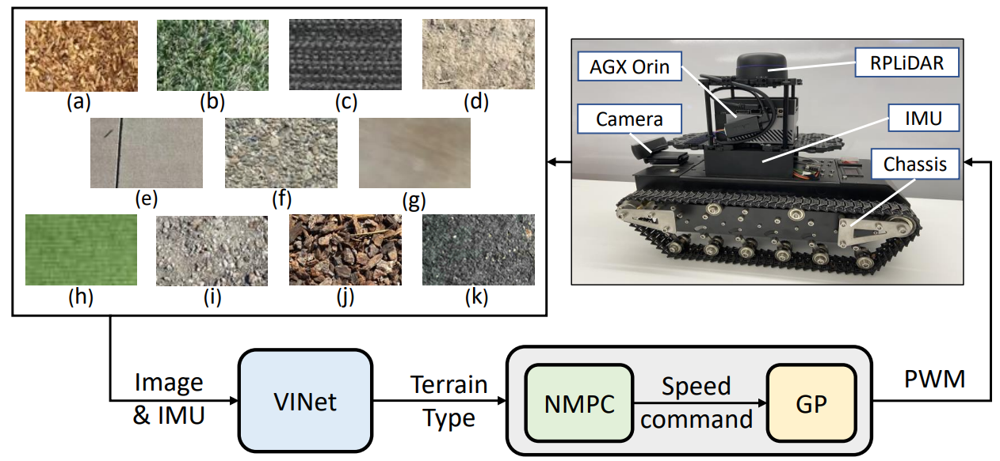

<p style="text-align:center;">

</p>

## Abstract
<div style="text-align: justify">We present a visual and inertial-based terrain classification network (VINet) for robotic navigation over different traversable surfaces. We use a novel navigation-based labeling scheme for terrain classification and generalization on unknown surfaces. Our proposed perception method and adaptive scheduling control framework can make predictions according to terrain navigation properties and lead to better performance on both terrain classification and navigation control on known and unknown surfaces. Our VINet can achieve 98.37% in terms of accuracy under supervised setting on known terrains and improve the accuracy by 8.51% on unknown terrains compared to previous methods. We deploy VINet on a mobile tracked robot for trajectory following and navigation on different terrains, and we demonstrate an improvement of 10.3% compared to a baseline controller in terms of RMSE.</div>
<br>

## Video
<iframe width="720" height="405" src="https://www.youtube.com/embed/qf5pJiq3rLI" frameborder="0" allow="accelerometer; autoplay; encrypted-media; gyroscope; picture-in-picture" allowfullscreen></iframe>

The paper is available [here](https://arxiv.org/abs/2209.07725). Please cite our work if you found it useful,

```
@misc{guan2023vinet,
      title={VINet: Visual and Inertial-based Terrain Classification and Adaptive Navigation over Unknown Terrain}, 
      author={Tianrui Guan and Ruitao Song and Zhixian Ye and Liangjun Zhang},
      year={2023},
      eprint={2209.07725},
      archivePrefix={arXiv},
      primaryClass={cs.RO}
}
```

