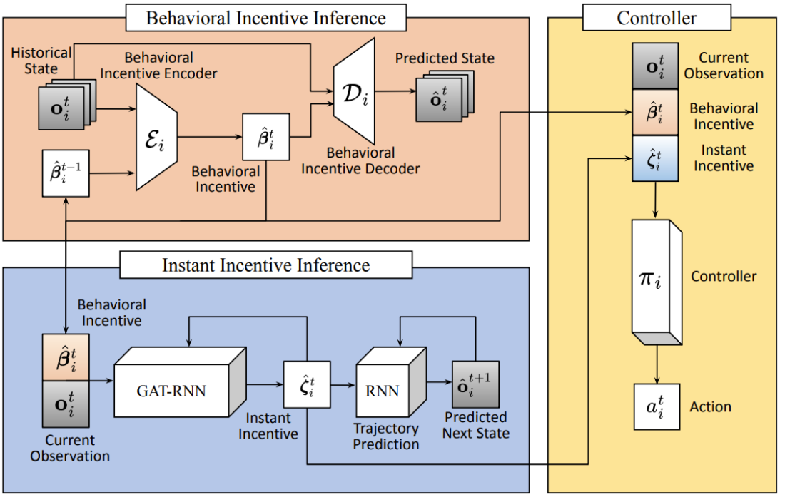

<p style="text-align:center;">

</p>

## Abstract
<div style="text-align: justify"> We present CrossLoc3D, a novel 3D place recognition method that solves a large-scale point matching problem in a cross-source setting. Cross-source point cloud data corresponds to point sets captured by depth sensors with different accuracies or from different distances and perspectives. We address the challenges in terms of developing 3D place recognition methods that account for the representation gap between points captured by different sources. Our method handles cross-source data by utilizing multi-grained features and selecting convolution kernel sizes that correspond to most prominent features. Inspired by the diffusion models, our method uses a novel iterative refinement process that gradually shifts the embedding spaces from different sources to a single canonical space for better metric learning. In addition, we present CS-Campus3D, the first 3D aerial-ground cross-source dataset consisting of point cloud data from both aerial and ground LiDAR scans. The point clouds in CS-Campus3D have representation gaps and other features like different views, point densities, and noise patterns. We show that our CrossLoc3D algorithm can achieve an improvement of 4.74% - 15.37% in terms of the top 1 average recall on our CS-Campus3D benchmark and achieves performance comparable to state-of-the-art 3D place recognition method on the Oxford RobotCar. </div>
<br>


|Paper|Code| Dataset | 
|:---|---|---|
|[**Crossloc3D**](https://arxiv.org/abs/2303.17778) | [**GitHub Code**](https://github.com/rayguan97/crossloc3d)| [**CS-Campus3d**](https://drive.google.com/file/d/1rFwfK3LxjMQnzlG_v_73dk63KyphnNjy/view) |

<br>


Please cite our work if you found it useful,

```
@InProceedings{Guan_2023_ICCV,
    author    = {Guan, Tianrui and Muthuselvam, Aswath and Hoover, Montana and Wang, Xijun and Liang, Jing and Sathyamoorthy, Adarsh Jagan and Conover, Damon and Manocha, Dinesh},
    title     = {CrossLoc3D: Aerial-Ground Cross-Source 3D Place Recognition},
    booktitle = {Proceedings of the IEEE/CVF International Conference on Computer Vision (ICCV)},
    month     = {October},
    year      = {2023},
}

```
