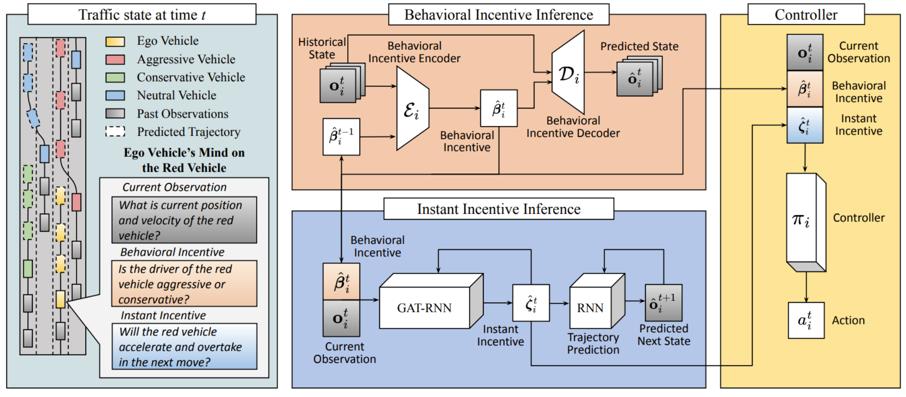

<p style="text-align:center;">

</p>

## Abstract
<div style="text-align: justify"> Navigating safely and efficiently in dense and heterogeneous traffic scenarios is challenging for autonomous vehicles (AVs) due to their inability to infer the behaviors or intentions of nearby drivers. In this work, we introduce a distributed multi-agent reinforcement learning (MARL) algorithm that can predict trajectories and intents in dense and heterogeneous traffic scenarios. Our approach for intent-aware planning, iPLAN, allows agents to infer nearby drivers intents solely from their local observations. We model two distinct incentives for agents strategies: Behavioral Incentive for high-level decision-making based on their driving behavior or personality and Instant Incentive for motion planning for collision avoidance based on the current traffic state. Our approach enables agents to infer their opponents behavior incentives and integrate this inferred information into their decision-making and motion-planning processes. We perform experiments on two simulation environments, Non-Cooperative Navigation and Heterogeneous Highway. In Heterogeneous Highway, results show that, compared with centralized training decentralized execution (CTDE) MARL baselines such as QMIX and MAPPO, our method yields a 4.3% and 38.4% higher episodic reward in mild and chaotic traffic, with 48.1% higher success rate and 80.6% longer survival time in chaotic traffic. We also compare with a decentralized training decentralized execution (DTDE) baseline IPPO and demonstrate a higher episodic reward of 12.7% and 6.3% in mild traffic and chaotic traffic, 25.3% higher success rate, and 13.7% longer survival time. </div>
<br>


|Paper|Code| 
|---|---|
|[**iPlan**](https://arxiv.org/abs/2306.06236) | [**GitHub Code**](https://github.com/wuxiyang1996/iPLAN)| 

<br>

Please cite our work if you found it useful,

```
@inproceedings{wu2023intent,
  title={Intent-Aware Planning in Heterogeneous Traffic via Distributed Multi-Agent Reinforcement Learning},
  author={Wu, Xiyang and Chandra, Rohan and Guan, Tianrui and Bedi, Amrit and Manocha, Dinesh},
  booktitle={7th Annual Conference on Robot Learning},
  year={2023}
}
```
