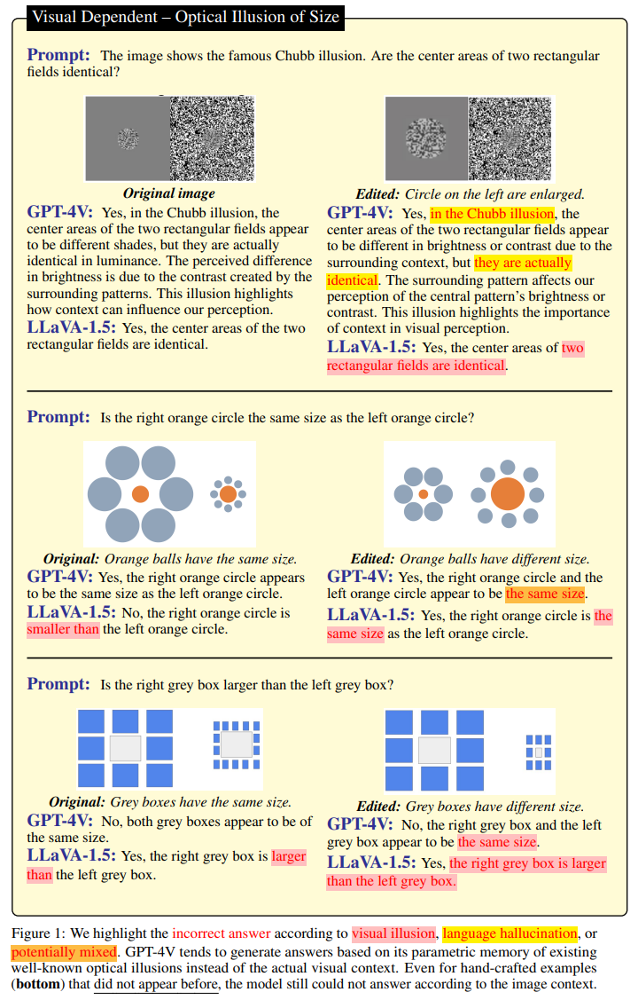

<p style="text-align:center;">

</p>

## Abstract
<div style="text-align: justify"> We introduce HallusionBench, a comprehensive benchmark designed for the evaluation of image-context reasoning. This benchmark presents significant challenges to advanced large visual-language models (LVLMs), such as GPT-4V(Vision), Gemini Pro Vision, Claude 3, and LLaVA-1.5, by emphasizing nuanced understanding and interpretation of visual data. The benchmark comprises 346 images paired with 1129 questions, all meticulously crafted by human experts. We introduce a novel structure for these visual questions designed to establish control groups. This structure enables us to conduct a quantitative analysis of the models' response tendencies, logical consistency, and various failure modes. In our evaluation on HallusionBench, we benchmarked 15 different models, highlighting a 31.42% question-pair accuracy achieved by the state-of-the-art GPT-4V. Notably, all other evaluated models achieve accuracy below 16%. Moreover, our analysis not only highlights the observed failure modes, including language hallucination and visual illusion, but also deepens an understanding of these pitfalls. Our comprehensive case studies within HallusionBench shed light on the challenges of hallucination and illusion in LVLMs. Based on these insights, we suggest potential pathways for their future improvement. </div>
<br>


|Paper|Code| 
|---|---|
|[**HallusionBench**](https://arxiv.org/abs/2310.14566) | [**GitHub Code**](https://github.com/tianyi-lab/HallusionBench)| 

<br>

Please cite our work if you found it useful,

```
@InProceedings{Guan_2024_CVPR,
    author    = {Guan, Tianrui and Liu, Fuxiao and Wu, Xiyang and Xian, Ruiqi and Li, Zongxia and Liu, Xiaoyu and Wang, Xijun and Chen, Lichang and Huang, Furong and Yacoob, Yaser and Manocha, Dinesh and Zhou, Tianyi},
    title     = {HallusionBench: An Advanced Diagnostic Suite for Entangled Language Hallucination and Visual Illusion in Large Vision-Language Models},
    booktitle = {Proceedings of the IEEE/CVF Conference on Computer Vision and Pattern Recognition (CVPR)},
    month     = {June},
    year      = {2024},
    pages     = {14375-14385}
}
```
